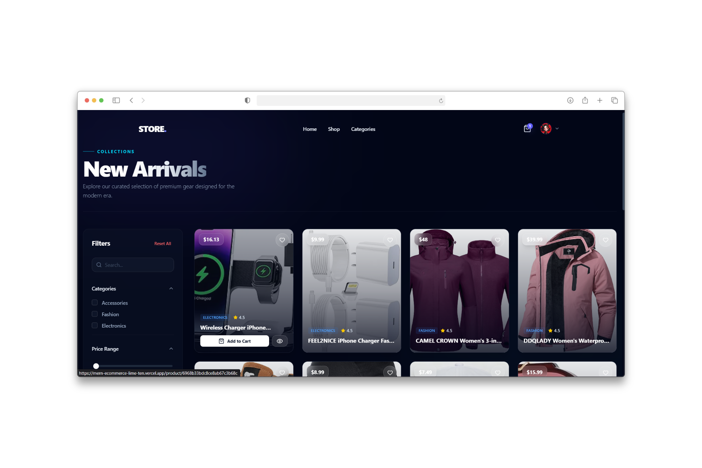
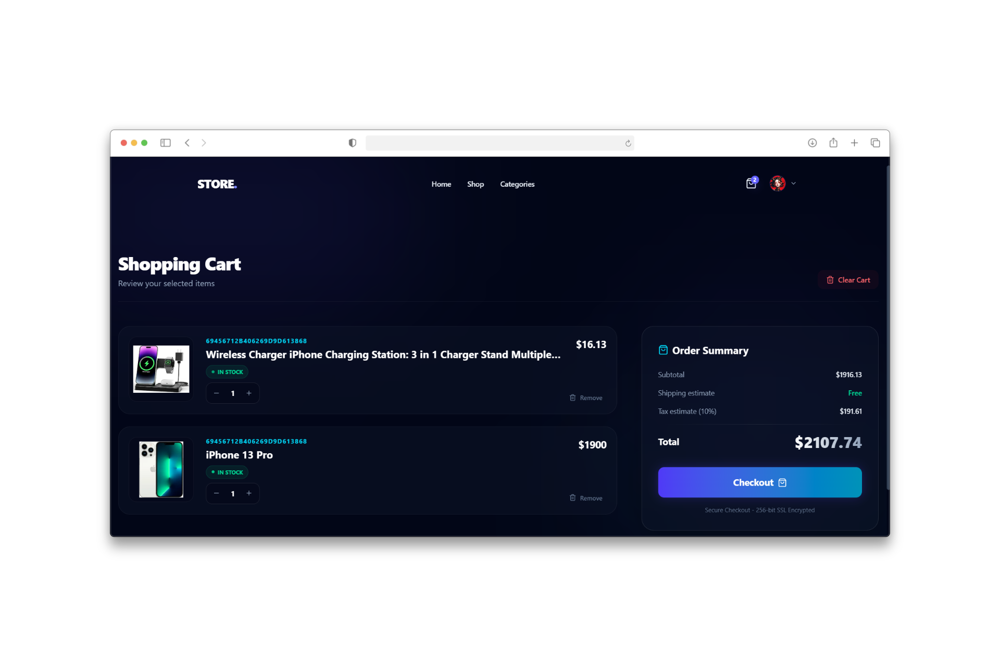
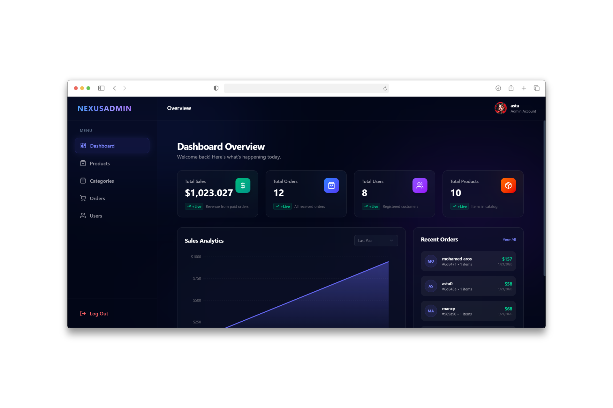

#  ProShop - Production-Ready MERN E-Commerce Platform

> A production-ready, full-stack e-commerce solution architected for scalability, performance, and security. Built with a **Smart Routing System**, **Hybrid Cart Architecture**, and **Advanced Server-State Management**.

[](https://mern-ecommerce-lime-ten.vercel.app/)
[](LICENSE)

---

##  System Architecture & Engineering Patterns

This project goes beyond basic CRUD apps by implementing advanced software engineering patterns:

###  The "Smart Router" (Role-Based Access Control)
I engineered a custom **Protected Routing System** to handle security and navigation dynamically:
- **Intelligent Redirection:** Automatically inspects user roles (`Admin` vs. `User`) and authentication state before rendering.
- **Security Layer:** Instantly redirects unauthorized users (e.g., a normal user attempting to access `/admin/dashboard`) to safe zones.
- **State Awareness:** Preserves the user's intended destination and redirects them back seamlessly after login.

###  **Hybrid Cart Engine**
A complex cart logic designed for maximum conversion:
- **Guest Persistence:** Cart items are stored in `LocalStorage` for guest users.
- **Database Synchronization:** Cart items are stored in `MongoDB` for logged-in users.
- **Auto-Merge Logic:** Automatically merges the local guest cart with the database cart upon authentication, ensuring no data loss.

###  Backend Engineering (Node.js/Express)
- **Centralized Error Handling:** Implemented a **Global Error Handler** middleware to catch operational errors and ensure consistent JSON responses.
- **Async Wrapper Pattern:** Replaced repetitive try-catch blocks with a custom wrapper for cleaner controllers.
- **Advanced API Features:** A reusable class handling **Server-Side Filtering, Sorting, Pagination, and Field Limiting**.

###  Network Layer (Axios & Interceptors)
- **Request Interceptors:** Automatically injects JWT tokens into secure requests.
- **Response Interceptors:** Global error catching (e.g., auto-logout on `401 Unauthorized` & session expiry handling).

---

##  Features Breakdown

###  Client-Side (The Storefront)
*Designed for a seamless user experience.*
- **High-Performance Data:** Utilized **TanStack Query** for aggressive caching, background updates, and zero-loading states.
- **Fully Responsive Design:** A Mobile-First UI built with **Tailwind CSS** that adapts perfectly to all screen sizes.
- **Advanced Product Discovery:** Real-time search and multi-criteria filtering (Category, Price).
- **Secure Checkout:** Integrated **Stripe** payment flow with order summary.
- **User Hub:** Profile management and order history tracking.
- **Authentication:** Secure Sign Up/Login with data sanitization.

###  Admin-Side (CMS Dashboard)
*A complete Content Management System for business control.*
- **Dynamic Category Management:** Create and manage product categories dynamically (not hardcoded).
- **Inventory Control:** Full CRUD operations for products with **Multer** & **Cloudinary** image pipelines.
- **Order Workflow:** Track and update order status (Processing ➝ Delivered).
- **User Management:** Monitor active users and manage system roles.

---
## 📸 Application Preview

<div align="center">
  <br />
  
  ### 🛍️ The Storefront (User Experience)
  <p><em>Immersive dark-themed landing page with premium aesthetics.</em></p>
    


  ### 🔍 Advanced Search & Filtering Engine
  <p><em>Real-time server-side filtering by category, price range, and search keywords.</em></p>
  


  ### 🛒 Smart Cart & Checkout Flow
  <p><em>Robust cart management with dynamic calculations and secure checkout capability.</em></p>
  
  

  ### ⚙️ Admin Dashboard (CMS)
  <p><em>Complete control panel for analytics, product management, orders, and users.</em></p>
  
</div>

---
##  Architecture & Folder Structure

The application follows a robust **MVC (Model-View-Controller)** architecture with a dedicated **Service Layer** to separate business logic from request handling.

```text
/
├── /backend
│   ├── /config         # ⚙️ DB Connection & Env Configuration
│   ├── /controllers    # 🎮 Request Processors (Input/Output only)
│   ├── /middleware     # 🛡️ Auth (JWT), Error Handling, Validation
│   ├── /models         # 🗄️ Mongoose Schemas (Data Layer)
│   ├── /routes         # 🛣️ API Endpoints Declaration
│   ├── /utils          # 🔧 Helpers (APIFeatures, Stripe)
│   └── index.js       # 🚀 App Entry Point
│
├── /frontend             # ⚛️ Frontend (React + Vite + Tailwind)
│   ├── /src
│   │   ├── /components # 🧩 Reusable UI Components
│   │   ├── /pages      # 📄 Route Views
│   │   ├── /store      # ⚡ State Management (Slices/Services)
│   │   └── /utils      # 🛠️ Client-side Helpers
│   │   ├── /services   # 📡 API Services (Axios wrappers & Endpoints)
│   │   └── /hooks      # 🎣 Custom Hooks (Logic Reuse)
│   └── ...
└── ...

```
##  Tech Stack

| Domain | Technologies |
|---|---|
| **Frontend** | React.js, **TanStack Query** (Server State), Redux/Context (Client State), Tailwind CSS |
| **Backend** | Node.js, Express.js, **Async Wrapper**, **Global Error Handler** |
| **Database** | MongoDB, Mongoose (Advanced Schema Methods) |
| **Network** | **Axios Instances & Interceptors** |
| **Media** | **Multer**, **Cloudinary API** |
| **Payment** | **Stripe API** |
| **Security** | JWT, Bcrypt, Express-Mongo-Sanitize, XSS-Clean |

---

## 🔮 Future Roadmap (Learning Path)
I am actively working on upgrading this architecture to industry-standard microservices and type-safe environments:
- [ ] **TypeScript Migration:** To ensure strict type safety and reduce runtime errors.
- [ ] **Dockerization:** Containerizing the application for consistent Dev/Prod environments.
- [ ] **Next.js:** Moving towards Server-Side Rendering (SSR) for better SEO.

---

## 🛠️ Installation & Setup

1. **Clone the repository:**
   ```bash
   git clone https://github.com/akx86/mern-ecommerce.git

2. **Install Dependencies:**
   ```bash
    npm install && npm install --prefix frontend
  
4. **Configure Environment Variables:**
   
   **Step A: Backend (.env in Root)**
   Create a `.env` file in the main folder:
   ```env
   NODE_ENV=development
   PORT=5000
   MONGO_URI=your_mongodb_connection_string
   JWT_SECRET=your_jwt_secret_key
   STRIPE_SECRET_KEY=your_stripe_secret_key
   CLOUDINARY_CLOUD_NAME=your_cloud_name
   CLOUDINARY_API_KEY=your_api_key
   CLOUDINARY_API_SECRET=your_api_secret
   ```
   **Step B: Frontend (.env in /frontend)**
   Create a .env file inside the frontend folder:
   ```env
   # Vite variables must start with VITE_
   VITE_API_URL=http://localhost:5000/api
   VITE_STRIPE_PUBLIC_KEY=your_stripe_publishable_key
  
 5. **Run Development Server:**
    ```bash
    # Run both frontend and backend concurrently
    npm run dev

  ---

  ## 👨‍💻 Author

  **Ahmed Khaled**
  
  *Full Stack Developer (MERN)*

  <div align="left">
    <a href="https://www.linkedin.com/in/ahmed-khaled-dev-/" target="_blank">
      
     </a>
    <a href="mailto:ahmedali245699@gmail.com" target="_blank">
      
    </a>
  </div>
  
  **📧 Email:** [ahmedali245699@gmail.com](mailto:ahmedali245699@gmail.com)
  <br />
